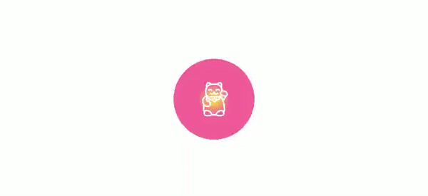

# [Beetlens](https://medium.com/@shliama/beetlens-42eac15503d0)

Beetlens is an open source app created for educational purposes by [Oleksii Shliama](https://github.com/shliama) at [Krootl](https://www.krootl.com).

Please refer to the [article](https://medium.com/@shliama/beetlens-42eac15503d0).

##

##

## License

This project is licensed under the MIT License - see the [LICENSE](LICENSE) file for details

## Acknowledgments

* App icon made by [Freepik](https://www.flaticon.com/authors/freepik)
* Beetle images by [Alexander Lesnitsky](https://pixabay.com/users/alles-2597842/)
